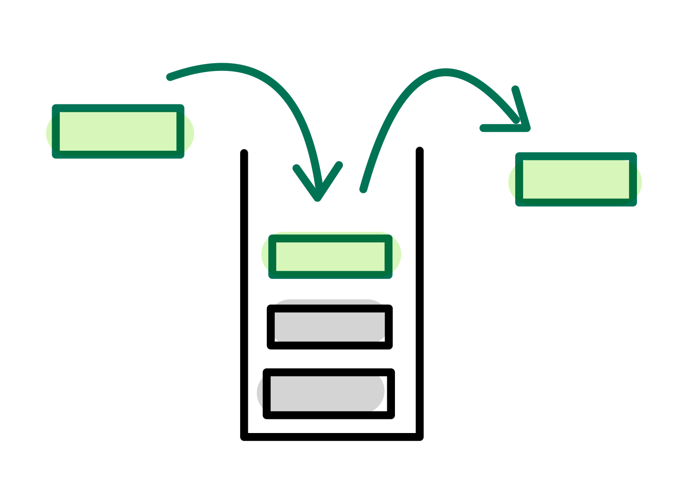
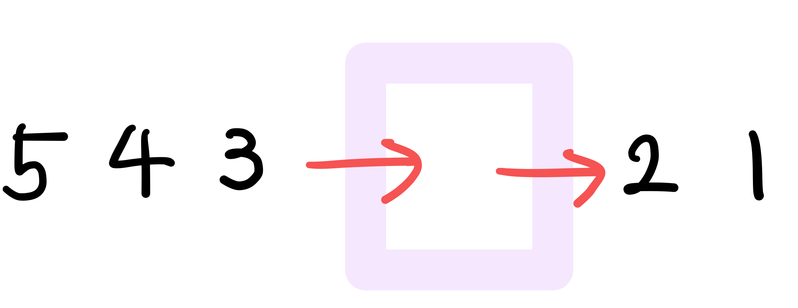

# DFS / BFS

그래프를 탐색하기 위한 대표적인 두 가지 알고리즘

*코테에서는 보통 DFS보다 BFS 구션이 조금 더 빠르게 동작한다*


#### 재귀함수

DFS, BFS를 구현하려면 재귀함수를 이해해야 한다.

재귀함수란 자기 자신을 다시 호출하는 함수이다.

재귀함수를 문제 풀이에 사요할 때는 재귀함수가 언제 끝날지 **종료조건을 꼭 명시**해야 한다.


## DFS

깊이 우선 탐색이라고도 부르며, 그래프에서 깊은 부분을 우선적으로 탐색하는 알고리즘


#### 그래프

기본 구조 -> 노드(Node, 정점 Vertex) 간선(Edge)

표기방식 두 가지

1. 인접 행렬: 2차원 배열로 그래프의 연결 관계를 표현
   - 2차원 배열에 각 노드가 연결된 형태를 기록하는 방식
   - 모든 관계를 저장하므로 노드 개수가 많을수록 메모리가 불필요하게 낭비됨
2. 인접 리스트: 리스트로 그래프의 연결 관계를 표현
   - 노드에 열결된 노드에 대한 정보를 차례대로 연결하여 저장
   - 연결된 정보만을 저장하기 떄문에 메모리를 효율적으로 사용 가능
   - 정보를 얻는 속도 느림


#### 스택



**선입후출(First In Last Out)** 구조

```python
stack = []
stack.append() # 스택 오른쪽에 삽입
stack.pop() # 스택 오른쪽 원소 삭제
```


#### 동작 과정

1. 탐색 시작 노드를 스택에 삽입하고 방문 처리를 한다
2. 스택의 최상단 노드에 방문하지 않은 입접 노드가 있으면 그 인접 노드를 스택에 넣고 방문 처리, 방문하지않은 인접 노드가 없으면 스택에서 최상단 노드를 꺼낸다
3. 위의 과정을 더 이상 수행할 수 없을 때까지 반복
4. ​

#### Tip

방문처리, 반복문(재귀함수) 중지 조건 주의하기


## BFS

너비 우선 탐색

가까운 노드부터 탐색하는 알고리즘

최대한 멀리 있는 노드부터 탐색하는 DFS와 반대

**시간복잡도 O(N)** 


#### 큐



**선입선출(First In First Out)** 구조 

```python
from collections import deque # 라이브러리
queue = deque()
queue.append() # 큐 오른쪽에 삽입
queue.popleft() # 큐 가장 왼쪽 원소 삭제
```


#### 동작 과정

1. 탐색 시작 노트를 큐에 삽입하고 방문처리를 한다.
2. 큐에서 노드를 꺼내 해당 노드의 인접 노드 중에서 방문하지 않은 노드를 모두 큐에 삽입하고 방문 처리를 한다.
3. 위의 과정을 더이상 수행할 수 없을 때까지 반복


#### Tip

방문처리 꼭 하기

코딩테스트에서는 보통 DFS보다 BFS 구현이 조금 더 빠르게 동작한다.

1차원, 2차원 배열이 등장해도 그래프 형태로 생각하면 수월하기 문제를 풀 수 있다.