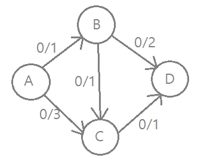
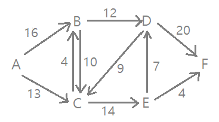
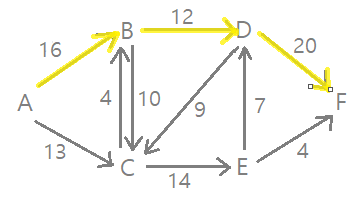
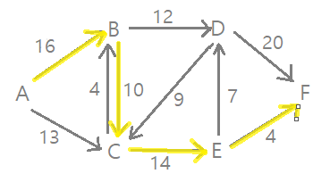
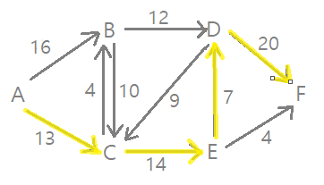
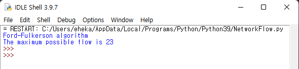
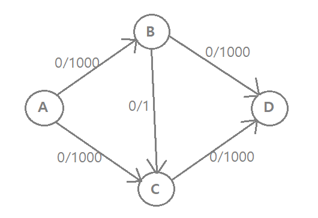

# Ford-Fulkerson Algorithm

## 네트워크 유량(Network Flow)
- source에서 sink로 동시에 보낼 수 있는 데이터나 사물의 최대 양을 구하는 알고리즘이다.
- 각 간선에 용량(Capacity)라는 추가 속성이 존재하는 방향 그래프. 이때 각 간선은 유량을 흘려보낼 수 있는 파이프 역할을 한다.

## 기본 용어
- Source(s): 유량이 시작되는 정점
- Sink(t): 유량이 도착하는 정점
- Capacity(용량): 간선에서 소화 가능한 최대 양 or 값
- Flow(유량): 간선에서 용량을 점유하고 있는, 사용하고있는 양 or 값
- c(a, b): 정점 a 에서 b로, 소화 가능한(남은) 용량 값
- f(a, b): 정점 a 에서 b로, 사용하고 있는(쓴) 유량 값

## 네트워크 유량(flow)의 특징
1. 용량의 제한
    - f(a,b) <= c(a,b)
    - 각 간선에 흐르는 유량은 그 간선의 용량보다 작거나 같다.
2. 유량의 보존성
    - source와 sink를 제외한 한 정점을 기준으로 해당 정점에 들어오는 유량의 총 합과 나가는 유량의 총 합은 같다.
3. 유량의 대칭성
    - f(u,v) = -f(v,u)
    - u에서 v로 유량이 흐르면, v에서 u로 음수의 유량이 흐르는 것과 동일하다.

## Ford-Fulkerson Algorithm 설명
### 동작 순서
1. 처음 유량 그래프에서 모든 간선에서의 유량을 0으로 초기화 하고, 역방향 간선의 유량도 0 으로 초기화한다.
2. source에서 sink로 보낼 수 있는, 잔여 용량이 남은 경로를 DFS로 찾아낸다.
3. 해당 경로에 존재하는 간선들의 잔여 용량 중, 가장 작은 값을 유량으로 흘려보낸다.
4. 해당 유량에 음수값을 취해, 역방향 간선에도 흘려보낸다. (*유량 상쇄)
5. 더 이상 잔여 용량이 남은 경로가 존재하지 않을 때까지 반복한다.

### 유량 상쇄(역간선)

- A->B->D  경로로 1, A->C->D 경로로 1의 유량을 흘려 보내면 최대 2 유량을 흘려보낼 수 있다.
- 만약 A->B->C 경로로 먼저 탐색하게 된다면 최대 유량은 1이 된다. 이는 최선의 답이 될 수 없다.
- 기존에 선택했던 경로를 취소하고, 새로운 경로를 만들 수 있으면 좀 더 개선된 답을 찾을 수 있다. 이를 유량 상쇄(역간선)라고 한다.
- 모든 경로에 기존에 존재하는 간선들과 반대되는 방향으로 간선을 추가한 뒤 각 간선으로 유량을 흘려보냈을 때, 반대 방향으로도 음의 유량을 흘려보냄으로써 유량을 상쇄시키는 것을 의미한다.
- 실제로는 불가능하지만 음의 유량을 기록함으로써 잔여 용량을 남겨 추가적인 경로를 탐색할 수있도록 하기 위한 작업이다.

## 코드 분석 및 실행

### 사용한 그래프

### 최대 유량을 옮길 수 있는 경우
 -> 12를 보냄

 -> 4를 보냄

 -> 7을 보냄

- 따라서 최대 유량 23을 보낼 수 있다

### Ford-Fulkerson Algorithm code
경로를 찾는 DFS 함수
~~~python 
def DFS(C, F, s, t): # (용량, 유량, 시작점, 도착점)
    stack = [s] # 시작점을 stack에 담음
    paths={s:[]}

    if s == t: # 시작점과 도착점이 같아지면 경로 반환
        return paths[s]
    
    while(stack): 
        u = stack.pop() # 맨 마지막 요소 호출 후 삭제(섭입후출)

        for v in range(len(C)): # 노드 개수 만큼 반복
            
            # 남은 용량이 0 이상이고 v가 경로에 포함되지 않으면 paths에 추가
            if(C[u][v]-F[u][v] > 0) and v not in paths:
                paths[v] = paths[u]+[(u,v)]
                #print('dfs paths', paths)

                # 목적지 t에 도달하면 paths 반환
                if v == t: 
                    return paths[v]

                stack.append(v)
    return None
~~~
- source 부터 시작하여 가까운 노드를 DFS로 탐색하며 sink에 도달하면 탐색을 종료한다.
- 용량이 남아있고 지나쳐온 경로에 포함되지 않은 노드만 경유한다.

~~~ python
def FordFulkerson(C, s, t):
    n = len(C) 
    F = [[0] * n for i in range(n)]

    path = DFS(C, F, s, t)
    while path != None:
        flow = min(C[u][v] - F[u][v] for u,v in path) # 경로의 용량들 중 최소 용량을 유량에 담는다
        
        # 유량 상쇄
        for u,v in path:
            F[u][v] += flow
            F[v][u] -= flow
        path = DFS(C,F,s,t)

    return sum(F[s][i] for i in range(n))
C = [[0, 16, 13, 0, 0, 0],
     [0, 0, 10, 12, 0, 0],
     [0, 4, 0, 0, 14, 0],
     [0, 0, 9, 0, 0, 20],
     [0, 0, 0, 7, 0, 4],
     [0, 0, 0, 0, 0, 0] ]

source = 0
sink = 5    

print("Ford-Fulkerson algorithm")
print("The maximum possible flow is", FordFulkerson(C, source, sink))
~~~
- source에서 sink까지 경로에서 가장 작은 용량을 경로의 용량을 flow에 담는다

### 실행 화면

### Edmonds-Karp Algorithm code
경로를 찾는 BFS 함수
~~~python
def BFS(C, parent, s, t): 
    visited = [False]*len(C)
    queue = [] # BFS를 위한 큐 생성

    # 소스 노드는 방문한 것으로 표시하고 큐에 삽입
    queue.append(s)
    visited[s]=True

    while queue:
        u = queue.pop(0) # 선입선출, 큐에서 가장 앞 원소 꺼내 u에 담고 삭제

        # 디큐된 u의 인접한 모든 정점을 가져온다.
        # 방문하지 않은 정점인 경우 방문했음을 표시하고 큐에 넣는다.
        for v in range(len(C)): 
            if visited[v] == False and C[u][v] > 0:
                queue.append(v)
                visited[v] = True # 방문처리
                parent[v] = u # 내가 거쳐온 길(바로 이전 길)
                
                if v == t: # 목적지(sink)에 도달하면 true를 리턴(BFS 종료)
                    return True

    # source부터 시작해서 BFS에 있는 sink에 도달하지 못하면 false를 반환
    return False
~~~

~~~python 
def EdmondsKarp(C, source, sink):
    parent = [-1]*len(C) # 이 배열은 BFS 및 저장 경로로 채워진다.
    max_flow = 0 # 초기 유량은 0

     # source에서 sink까지 경로가 있는 동안 flow 증가
    while BFS(C, parent, source, sink):
        
        path_flow = float("inf") # 양의 무한대 값
        s = sink

        # 도착지(sink)에 도달하지 않은 경우
        # BFS가 채운 경로를 따라 용량들 중 작은 값이 path_flow가 됨
        while(s != source): 
            path_flow = min(path_flow, C[parent[s]][s])
            s = parent[s]

        max_flow += path_flow # 전체 flow에 경로 flow 추가

        # 유량상쇄, 잔존 용량 업데이트
        v = sink
        while(v != source):
            u = parent[v]
            C[u][v] -= path_flow
            C[v][u] += path_flow
            v = parent[v]
    return max_flow
~~~
### 실행 화면

## 성능분석 (포드-풀커슨 알고리즘 VS 애드몬드-카프 알고리즘)

### 포드-풀커슨 알고리즘
- DFS 방식으로 증가 경로를 찾는다.
- DFS 방식으로 경로를 탐색하는 방법은 비효율적으로 동작할 수 있다.

### 애드몬드-카프 알고리즘
- BFS 방식으로 증가 경로를 찾는다.

### DFS의 비효율적인 면을 극단적으로 보여주는 example

- DFS를 이용하면
    A->B->C->D (1 보냄)
    A->C->B->D (역간선 이용해 1 보냄)
    을 2000번 탐색하여 최대 유량인 2000의 유량을 보낼 수 있다.
- BFS를 이용하면
    A->B->D (1000 보냄)
    A->C->D (1000 보냄)
    두 번의 탐색으로 최대 유량을 찾아낼 수 있다.
- 문제의 flow가 적고 edge가 많으면 오히려 포드-풀커슨 알고리즘이 효율적일 수 있다.

## 시간 복잡도
(E: 간선, V: 정점, F: 최대 유량)
- DFS로 경로를 찾는 포드-풀커슨 알고리즘: O(F*E)
- BFS로 경로를 찾는 에드몬드-카프 알고리즘: O(V*(E^2))

