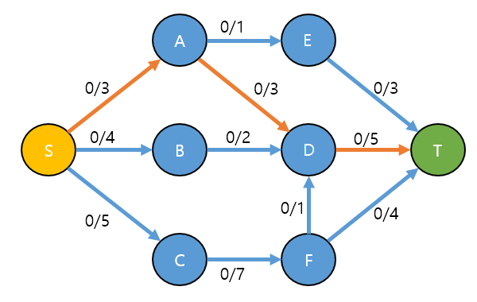
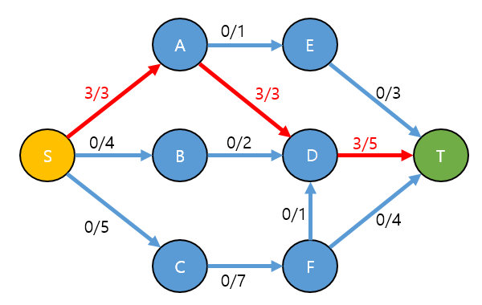
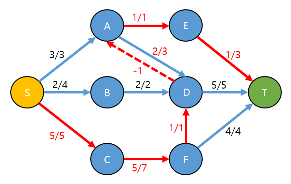
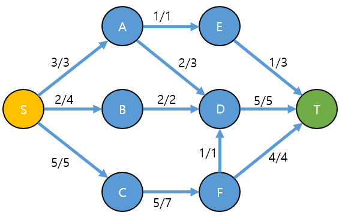
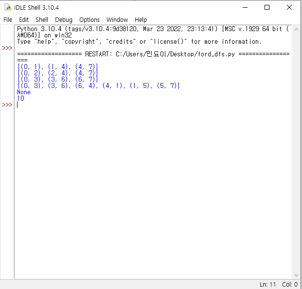
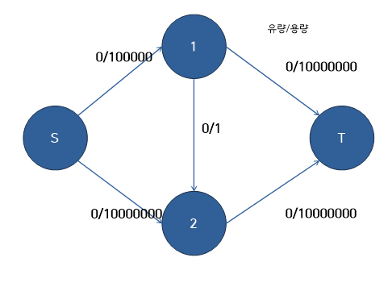
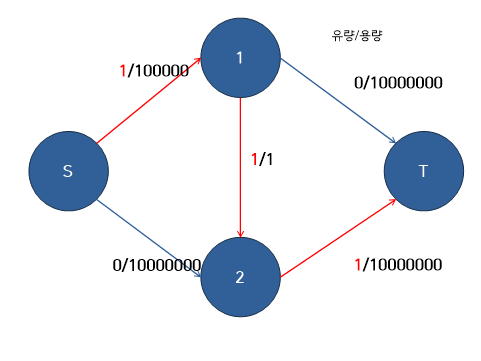
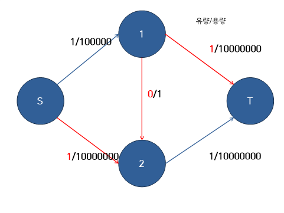
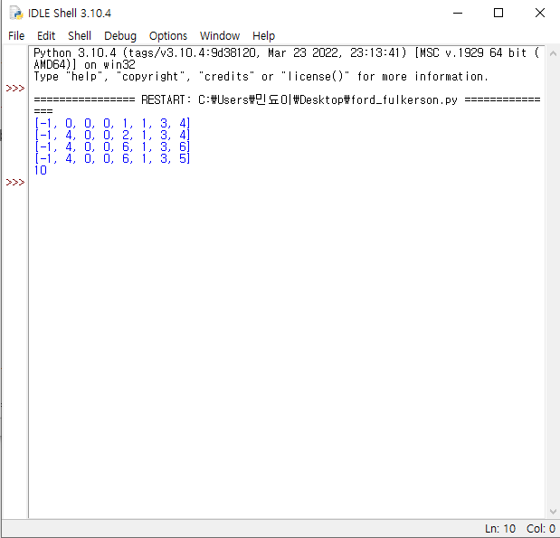

## Ford-Fulkerson 알고리즘

#### 용어 정리

· **유량(flow)** : 두 정점 사이에서 흐르는 양
· **용량(capacity)** : 두 정점 사이에 최대로 흐를수 있는 양
· **소스(source)** : 유량이 시작되는 정점. 보통 S로 많이 나타낸다
· **싱크(sink)** : 유량이 도착하는 정점. 보통 T로 많이 나타낸다
· **증가경로(augmenting path)** : 소스에서 싱크로 유량을 보내는 경로 
· **잔여용량(residual capacity)** : 현재 흐를수 있는 유량. 즉 용량-유량을 의미한다.

#### 네트워크 플로우가 성립하기 위한 조건

· c(u,v) : capacity의 약자로 정점 u에서 v로 가는 간선의 용량
· f(u,v) : flow의 약자로 정점 u에서 v로 실제 흐르는 유량

**1) 용량 제한 속성 f(u,v) <= c(u,v):**
두 간선에서 흐르는 유량은 용량을 넘을 수 없다.
**2) 유량의 대칭성 f(u,v) = -f(v,u):**
u->v로 10만큼 흐른다면 v->u엔 -10만큼 흐른다고 생각할 수 있다.
**3) 유량 보존의 법칙 ∑f(u,v)=0** **:**
source 와 sink를 제외하고는 각 정점에서 들어오는 유량과 나가는 유량이 일치해야한다.

#### 작동방식

1) DFS를 통해 증가경로를 찾고 찾은 만큼 유량을 흘려보낸다.

2) 더 이상 증가경로를 찾을 수 없을 때까지 1)을 반복한다.



위와 같은 그래프가 주어졌을 때

아래와 같이 S -> A -> D -> T 와 같은 경로로 가장 적은 유량인 3을 흘려보낸다.



비슷하게 

S -> B -> D -> T 경로로 유량 2를 보내고, S -> C -> F -> T 유량 4를 보내면

총 유량의 합은 3+2+4 = 9가 된다.

그렇지만 사실 이것이 정답은 아니다.

이럴 때는 역간선을 사용해 유량을 흘려보내는데, 쉽게 설명하면  **갔던 길을 취소**하는 것이다.



D -> A를 잇는 간선이 있다고 생각하면 S -> C -> F -> D -> A -> E -> T라는 경로로 1만큼의 유량을 흘려보내게 되는데 이 때 D -> A의 경로는 A -> D에 흘렀던 유량에서 1만큼을 취소해 A -> E -> T의 경로로 흘려보낸다.

위와 같이 흐르게 되어

Maximum flow는 3+2+5 = 10 이된다.

```python
def dfs(C, F, s, t):
        stack = [s]
        paths={s:[]}
        if s == t:
                return paths[s]
        while(stack):
                u = stack.pop(0)
                for v in range(len(C)):
                        if(C[u][v]-F[u][v]>0) and v not in paths:
                                paths[v] = paths[u]+[(u,v)]
                                if v == t:
                                        return paths[v]
                                stack.append(v)
        return None

def max_flow(C, s, t):
        n = len(C)
        F = [[0] * n for i in range(n)]
        path = dfs(C, F, s, t)
        print(path)
        while path != None:
            flow = min(C[u][v] - F[u][v] for u,v in path)
            for u,v in path:
                F[u][v] += flow
                F[v][u] -= flow
            path = dfs(C,F,s,t)
            print(path)
        return sum(F[s][i] for i in range(n))
    

C = [[0, 3, 4, 5, 0, 0, 0, 0],
    [0, 0, 0, 0, 3, 1, 0, 0],
    [0, 0, 0, 0, 2, 0, 0, 0],
    [0, 0, 0, 0, 0, 0, 7, 0],
    [0, 0, 0, 0, 0, 0, 0, 5],
    [0, 0, 0, 0, 0, 0, 0, 3],
    [0, 0, 0, 0, 1, 0, 0, 4],
    [0, 0, 0, 0, 0, 0, 0, 0]]  

source, sink = 0, 7  
max_flow_value = max_flow(C, source, sink)
print(max_flow_value)
```



해당 코드를 실행했을 때의 결과이다.

위 그림과 똑같은 경로로 가는 것을 확인할 수 있다.

하지만 dfs로 구현하였을 때의 문제점이 있다.



이런 그래프가 있을 경우





이런식으로 증가경로 한개당 플로우를 1개씩밖에 보내지 못하여 플로우 수가 큰 경우에는 많이 반복하게 된다.

시간복잡도는 **O(EF)**가 된다. (E는 에지 수, F는 최대유량)

이러한 문제점을 해결하려면 dfs로 구현한 부분을 bfs로 변경을 해주면 된다. **(에드먼드-카프 알고리즘)**

```python
def BFS(graph, s, t, parent):
    visited = [False] * len(graph)
    queue = []
    queue.append(s)
    visited[s] = True
 
    while queue:
        u = queue.pop(0)
        for ind in range(len(graph[u])):
            if visited[ind] is False and graph[u][ind] > 0:
                queue.append(ind)
                visited[ind] = True
                parent[ind] = u
 
    return True if visited[t] else False
 
 
def FordFulkerson(graph, source, sink):
    parent = [-1] * (len(graph))
    max_flow = 0
    while BFS(graph, source, sink, parent):
        print(parent)
        path_flow = float("Inf")
        s = sink
 
        while s != source:
            path_flow = min(path_flow, graph[parent[s]][s])
            s = parent[s]
 
        max_flow += path_flow
        v = sink
 
        while v != source:
            u = parent[v]
            graph[u][v] -= path_flow
            graph[v][u] += path_flow
            v = parent[v]

    return max_flow
 
 
graph = [
    [0, 3, 4, 5, 0, 0, 0, 0],
    [0, 0, 0, 0, 3, 1, 0, 0],
    [0, 0, 0, 0, 2, 0, 0, 0],
    [0, 0, 0, 0, 0, 0, 7, 0],
    [0, 0, 0, 0, 0, 0, 0, 5],
    [0, 0, 0, 0, 0, 0, 0, 3],
    [0, 0, 0, 0, 1, 0, 0, 4],
    [0, 0, 0, 0, 0, 0, 0, 0]
]
 
source, sink = 0, 7
print(FordFulkerson(graph, source, sink))
```

위에 dfs 예시의 그래프를 똑같이 사용해보겠다.

소스에서 시작했을 때 A, B, C가 연결되어 있어 큐에 A, B, C가 들어오게 된다.

queue = [A, B, C]

A를 pop하면서 A에 연결된 D, E가 들어오게된다.

queue = [B, C, D, E]

이 때 A는 이전 노드인 S(0)을 partent에 저장하게 된다.

parent = [-1, 0, -1, -1, -1, -1, -1, -1]

이런식으로 반복하다 보면 parent에는 각자 노드의 이전노드가 저장이 된다.

parent = [-1, 0, 0, 0, 1, 1, 3, 4]

싱크에 저장되어 있는 이전 노드를 따라가보면

 S -> A -> D -> T 의 순으로 거쳐왔다는 것을 확인할 수 있고 가장 적은 플로우를 max_flow에 저장한다.

T -> D -> A -> S 의 순으로 흐른 유량만큼의 역간선을 생성해 준 뒤

갈 수 있는 경로를 모두 갈 때까지 bfs를 사용해 돌려주면 이전과 같은 정답이 나오게 된다.



위는 각 노드의 지나온 경로를 저장하는 parent배열을 출력한 결과다.

bfs로 구현했을 때의 시간복잡도는 **O(VE^2) or O(EF)**중 작은 것이라고 한다.