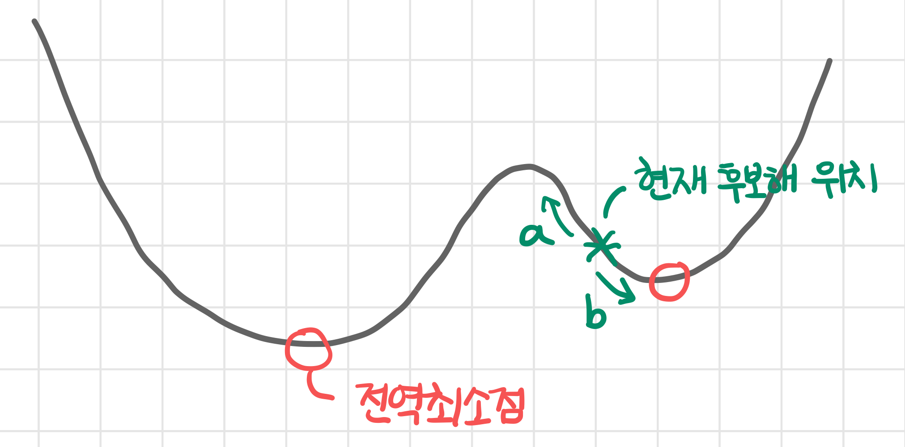
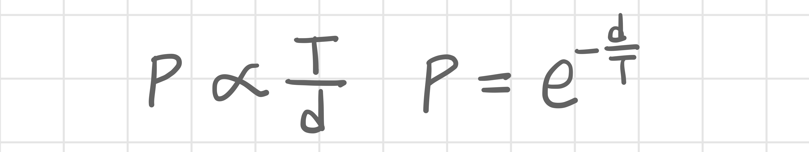
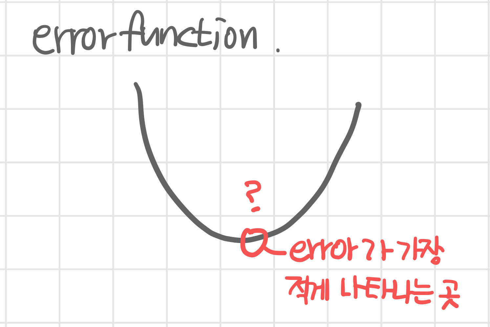
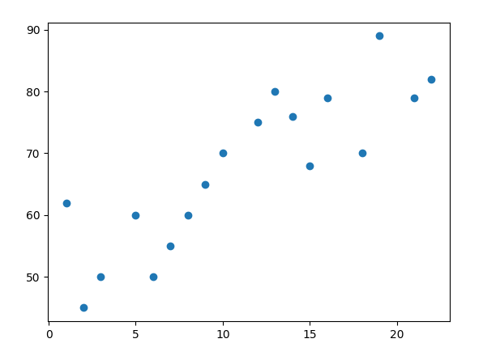

# 최적화 알고리즘을 이용한 회귀식 추정

## 모의 담금질
- 이웃해: 후보해가 될 수 있는 후보
- 후보해: 답이 될 수 있는 후보, 1개

### 이웃해 선정 시 고려사항

- 위와 같은 경우 적합도가 가장 높은 곳으로 가기 힘들 수 있다. 현재 후보해 위치에서 a방향으로 이웃해를 선정하면, 이웃해가 후보해가 될 가능성이 낮아지기 때문에 b방향으로 이웃해를 선정할 가능성이 높아진다.하지만 우리가 찾고있는 전역최소점은 a방향에 위치하기 때문에 후보해 생성 가능성이 낮은 지점도 이웃해가 될 수 있어야 한다.

### 안좋은 이웃해가 선택될 확률 p

- 초기온도 T: T가 높으면 안좋은 해를 선택할 가능성이 높아진다.
- 간극 d: d가 낮으면 안좋은 해를 선택할 확률이 높아진다.

### 모의 담금질 순서
1. 이웃해 선택 방식을 결정한다(범위 안에서 random으로 선택하는 방법, 가까운 곳 선택 등)
2. 후보해, 이웃해 적합도 평가
3. 두 적합도 차이 계산
    - 이웃해 적합도-후보해 적합도 > 0 : 이웃해가 후보해가 됨
    - 이웃해 적합도-후보해 적합도 < 0 : 확률(p)에 따라 안좋은 이웃해가 후보해가 될 수도 있음
4. 온도 낮춤 T=aT.

T=0(일정한 값 이하)까지, 또는 후보해 적합도와 이웃해 적합도의 차가 미미해 질 때까지 위 과정을 반복한다

## 회귀식 추정하는 방법

### 회귀
회귀는 독립변수(independent variable) 또는 예측인자(predictor)라 부르는 변수 X와 종속변수(dependent variable) 또는 예측량(predictand)이라 부르는 변수 Y의 관계를 함수식으로 설명하는 통계적 방법이다. 이 때 관계를 설명하는 함수식을 회귀모형 또는 회귀식이라고 부른다.

### 선형 회귀식 추정 방법
- f(x)=ax+b로 두고 a, b 값을 추측한다.
- x=x'일 때 실제 값 y와 추정한 값 y'의 값의 차를 구한다
- y-y'= error!
- error function: 모든 표본의 (y-y')^2의 합

- 에러가 가장 적게 나타나는 지점을 모의 담금질 기법을 사용하여 구하면 된다.

## 회귀식 추정
### 선택한 모델
자녀와 조부모의 나이를 그린 1차 회귀식을 가정하였음
kid = [1,2,3,5,6,7,8,9,10,12,13,14,15,16,18,19,21,22]
grandparents = [62,45,50,60,50,55,60,65,70,75,80,76,68,79,70,89,79,82]

### 최적화 알고리즘 구현(모의 담금질 기법)
~~~python
# 모의담금질
임의의 후보해 s 선택
초기 T 정함
while T=0(일정한 값 이하)까지, 또는 후보해 적합도와 이웃해 적합도의 차가 미미해 질 때까지 반복
    for i in range(1,kt)
        s의 이웃해 중에서 랜덤하게 하나의 해 s 선택
        d= (s`값)-(s 값)
        if (d<0) # 이웃해가 더 우수하면
            s <- s` # 이웃해가 후보해가 됨
        else
            q = random(0,1) 
            if q < p # p는 안좋은 해 선택할 확률
                s <- s` # 안좋은 이웃해가 후보해가 됨
    T = aT # 1보다 작은 수 a(약 0.9-0.95 정도)를 곱하여 온도를 낮춘다
~~~