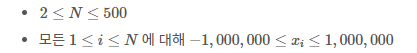

# [백준 25401] 카드 바꾸기

## 문제

난이도: 골드5

[25401번: 카드 바꾸기](https://www.acmicpc.net/problem/25401)

N개의 카드가 놓여있다. 편의상 가장 왼쪽에 있는 카드를 1번 카드, 그 다음에 있는 카드를 2번 카드 … 가장 오른쪽에 있는 카드가 N번 카드라고 하자.

N개의 카드에는 각각 정수가 하나씩 적혀있다. i번 카드에 적혀있는 수를 xi라고 하자.

N개의 카드 중 일부에 적혀있는 수들을 적절히 바꾸어서, 왼쪽에서 오른쪽으로 갈수록 카드에 적혀있는 수들이 일정하게 증가하거나, 감소하거나, 또는 모든 수들이 같도록 하고 싶다.

카드에 적혀있는 수들을 바꿀 때는 정수 값으로만 바꿀 수 있으며, 바꾸는 횟수를 최소화해야 한다.

### 입력

첫 번째 줄에 카드의 수 N이 주어진다.

두 번째 줄에는 각 카드에 적힌 수 xi가 공백을 사이에 두고 순서대로 주어진다.



### 예제


## 풀이

### 입력받기

```python
N = int(input())
arr = [0] + list(map(int, input().split()))
```

### 부분 문제 1) N이 3 이하일 때,

N이 3보다 작다는 것 → N은 2 아니면 3

- N이 2라면❓ 바꿀 필요x 따라서 N이 2라면 답이 0
- N이 3이라면❓ a, b, c 세개의 숫자라고 했을 때 a와 b의 차이와, b와 c의 차이를 확인
    - 두 수의 차이가 같다면 바꿀 필요x. 즉, 답 = 0
    - 두 수의 차이가 있다면 둘 중 하나만 바꿔주면 문제가 해결됨. 즉, 답 =1

```python
if N == 2:
    print(0)
elif N == 3:
    _, a, b, c = arr # arr을 만들 때 맨 앞에 0을 넣어놓았기 때문에 4개의 숫자를 받음
    if b - a == c - b:
        print(0)
    else:
        print(1)
```

### 2) N이 4이상일 때

몇 개의 카드가 있던지 기준이 되는 두 개의 숫자는 건드리지 않아도 됩니다. 따라서 여기서 최대 바꿀 수 있는 카드의 숫자는 N - 2개 입니다. 

⭐기준이 되는 2개의 숫자로 카드를 계산하여 교환을 최소로 하는 경우를 찾으면 됩니다

### 2-1) 등차수열로 만들 수 있는지 확인

1. 기준이 되는 두 개의 숫자는 이중 for문으로 만듭니다
    
    ```python
    for i in range(1, N): # 0번 인덱스는 제외
        for j in range(i + 1, N + 1):
                    pass
    ```
    
2. 두 개의 숫자를 정했으면 두 수의 차이를 확인해야 합니다. 
    - 두 숫자의 차이를 구하고 두 숫자 사이의 인덱스 값을 등차수열로 만들 수 있어야 합니다
    $(arr[j]-arr[i])/(j-i)$ 이 공식을 수행했을 때 값이 정수 또는 0 이어야 합니다.
    
    ```python
    ans = 500 # 카드의 최대값은 500이기 때문에 ans의 초깃값을 500으로 함
    for i in range(1, N):
        for j in range(i + 1, N + 1):
            diff = (arr[j] - arr[i]) / (j - i)
    
            if diff - int(diff) != 0:
                continue
    
            ans = min(ans, check(arr[i] - diff * i, diff)) # 최소숫자를 찾기 위함
    print(ans)
    ```
    

### 2-2) check 함수: 등차수열이 가능할 때, 몇 개의 숫자를 바꿔야 하는지 확인

diff 로 만든 차이로 리스트를 만들었을 때 몇 개의 숫자를 바꿔야 하는지 확인하는 함수 check 입니다.

리스트의 시작 값은 $arr[i]-diff*i$ 입니다.

시작 값에서 diff를 한번씩 더해나가며  arr 의 값과 비교하여 일치하지 않으면 변경해야 하므로 cnt+1 합니다.

```python
def check(s, diff):
    cnt = 0
    for i in range(1, N + 1):
        s += diff
        if arr[i] != s:
            cnt += 1
    return cnt
```

### 전체 코드

```python
N = int(input())

arr = [0] + list(map(int, input().split()))

def check(s, diff):
    cnt = 0
    for i in range(1, N + 1):
        s += diff
        if arr[i] != s:
            cnt += 1
    return cnt

ans = 500
for i in range(1, N):
    for j in range(i + 1, N + 1):
        diff = (arr[j] - arr[i]) / (j - i)

        if diff - int(diff) != 0:
            continue

        ans = min(ans, check(arr[i] - diff * i, diff))
print(ans)
```

참고

[https://wikidocs.net/207391](https://wikidocs.net/207391)