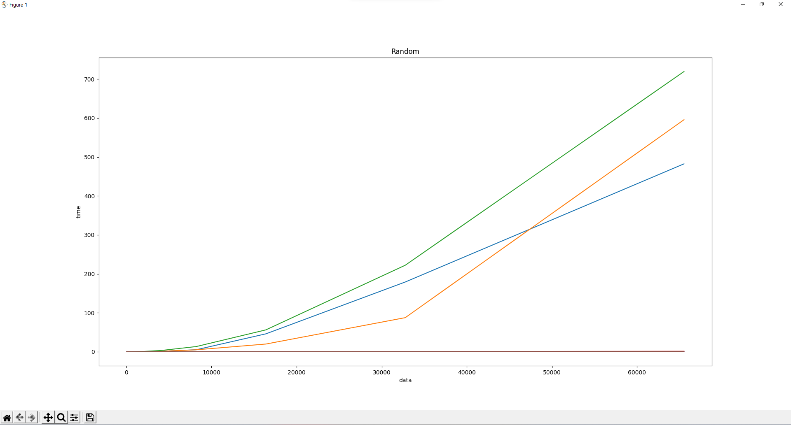

# 정렬 알고리즘

## 버블 정렬
- 서로 인접한 두 원소를 검사하여 정렬하는 방식

## 선택 정렬
- 가장 작은 데이터를 석택해 맨 앞에 있는 데이터와 바꾸는 방식

## 삽입 정렬
- 삽입 정렬은 두 번째 자료부터 시작하여 그 앞(왼쪽)의 자료들과 비교하여 삽입할 위치를 지정한 후 자료를 뒤로 옮기고 지정한 자리에 자료를 삽입하여 정렬하는 알고리즘

## 쉘 정렬
- 일정한 간격으로 떨어져 있는 자료들끼리 부분집합을 구성하고 목록을 일정 간격(gap=n/2)의 부분집합으로 나눠 각 부분집합에 대해 삽입정렬을 수행하는 방식

## 힙 정렬
- 완전 이진 트리의 일종으로 우선순위 큐를 위하여 만들어진 자료구조

## 퀵 정렬
- 기준 데이터를 설정하고 그 기준보다 큰 데이터와 작은 데이터의 위치를 교환한 후 리스트를 반으로 나누는 방식

## 시간복잡도

# 데이터 입력 경우

## 1. 오름차순으로 정렬된 데이터

쉘, 힙, 퀵 정렬만 확대하여 관찰: (파란색: 쉘, 초록색: 퀵, 주황색: 힙 정렬)

각 정렬들이 걸린 시간[2^5개 데이터 정렬 시간, 2^6개 데이터 정렬 시간, ...]
- 버블 = [0.0, 0.0, 0.000990152359008789, 0.001995563507080078, 0.0, 0.03470134735107422, 0.1434612274169922, 0.5872316360473633, 2.441920518875122, 10.052408456802368, 50.45694160461426, 170.43879914283752] 
- 선택 = [0.0010352134704589844, 0.0, 0.001027822494506836, 0.00304412841796875, 0.005944728851318359, 0.06344485282897949, 0.2829899787902832, 1.1031625270843506, 4.394201040267944, 17.88708782196045, 72.71108293533325, 390.2975206375122]
- 삽입 = [0.0, 0.0, 0.0, 0.002830982208251953, 0.0, 0.03797626495361328, 0.17460966110229 492, 0.6108298301696777, 2.519280433654785, 10.46173357963562, 43.828295946121216, 174.45724320411682] 
- 쉘 = [0.0, 0.0, 0.0, 0.0009975433349609375, 0.0, 0.0009968280792236328, 0.0029916763305664062, 0.005984067916870117, 0.01296544075012207, 0.028974294662475586, 0.05673551559448242, 0.1431429386138916] 
- 힙 = [0.0, 0.0010213851928710938, 0.0, 0.0, 0.0, 0.0, 0.0009627342224121094, 0.002003908157348633, 0.0029969215393066406, 0.005980730056762695, 0.012916326522827148, 0.027107715606689453]
- 퀵 = [0.0, 0.0, 0.0, 0.0009980201721191406, 0.0, 0.0009968280792236328, 0.001994609832763672, 0.002991914749145508, 0.008975982666015625, 0.01709580421447754, 0.042253971099853516, 0.08447265625] 

## 2. 랜덤하게 정렬된 데이터

표준편차 그래프

## 3. 내림차순으로 정렬된 데이터

쉘, 힙, 퀵 정렬만 확대하여 관찰: (파란색: 쉘, 초록색: 퀵, 주황색: 힙 정렬)

각 정렬들이 걸린 시간 [2^5개 데이터 정렬 시간, 2^6개 데이터 정렬 시간, ...]
- 버블 = [0.0, 0.0009632110595703125, 0.0019998550415039062, 0.005939483642578125, 0.029327869415283203, 0.10229372978210449, 0.40494346618652344, 1.642212152481079, 7.1 0706639289856, 27.311939001083374, 110.39799785614014, 445.44341802597046, 2330.8638095855713] 
- 선택 = [0.0, 0.0010008811950683594, 0.0010221004486083984, 0.0, 0.016810894012451172, 0.06609368324279785, 0.29154062271118164, 1.1004815101623535, 4.935121297836304, 18.550434112548828, 76.87665128707886, 399.58873558044434, 1327.7039682865143] 
- 삽입 = [0.0, 0.0, 0.002988100051879883, 0.012964248657226562, 0.024797439575195312, 0.10870909690856934, 0.4945356845855713, 2.0201916694641113, 7.824868679046631, 34.373873710632324, 122.42249917984009, 495.8663022518158, 1702.3987171649933] 
- 쉘 = [0.0, 0.0, 0.0, 0.0, 0.002238035202026367, 0.002026081085205078, 0.004995822906494141, 0.01130366325378418, 0.023824453353881836, 0.05168342590332031, 0.10695958137512207, 0.2045881748199463, 0.44809818267822266] 
- 힙 = [0.0, 0.0, 0.005148649215698242, 0.0009989738464355469, 0.0009968280792236328, 0.0009975433349609375, 0.0009968280792236328, 0.0009975433349609375, 0.0039892196 65527344, 0.005983829498291016, 0.014031171798706055, 0.03630661964416504, 0.08570337295532227]
- 퀵 = [0.0, 0.0, 0.0, 0.0, 0.0, 0.0, 0.0, 0.0, 0.015359878540039062, 0.0234525203704834, 0.04857826232910156, 0.08932161331176758, 0.16855287551879883]

## 관찰 결과
- 그래프를 관찰한 결과 버블, 선택, 삽입 정렬은 모두 O(N^2)의 시간 복잡도를 갖지만, 
- 버블정렬(파란색 그래프)은 내림차순으로 정렬된 데이터를 오름차순으로 정렬할 때 가장 효율이 떨어진다.
- 선택정렬(노란색 그래프)은 오름차순으로 이미 정렬되어 있는 데이터를 정렬할 때 가장 효율이 떨어지고, 내림차순으로 정렬되어 있는 자료를 오름차순으로 재정렬할 때 최적의 효율을 보여준다.
- 삽입정렬(초록색 그래프)은 오름차순으로 정렬된 데이터를 정렬할 때 가장 효율이 좋다. 즉, 데이터가 어느정도 정렬되어있을 때 훨씬 효율적이다.
- 쉘, 힙, 퀵정렬은 많은 수의 데이터를 정렬시켜도 걸리는 시간이 0에 가깝다.
- 쉘 > 퀵 > 힙정렬 순으로 데이터 정렬 시간이 오래 걸린다.
- 쉘, 힙, 퀵 정렬은 오름차순 데이터보다 내림차순 데이터를 정렬할 때 효율이 떨어진다.(오름차순 데이터를 정렬할 때 효율이 좋다)
